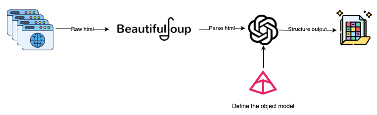
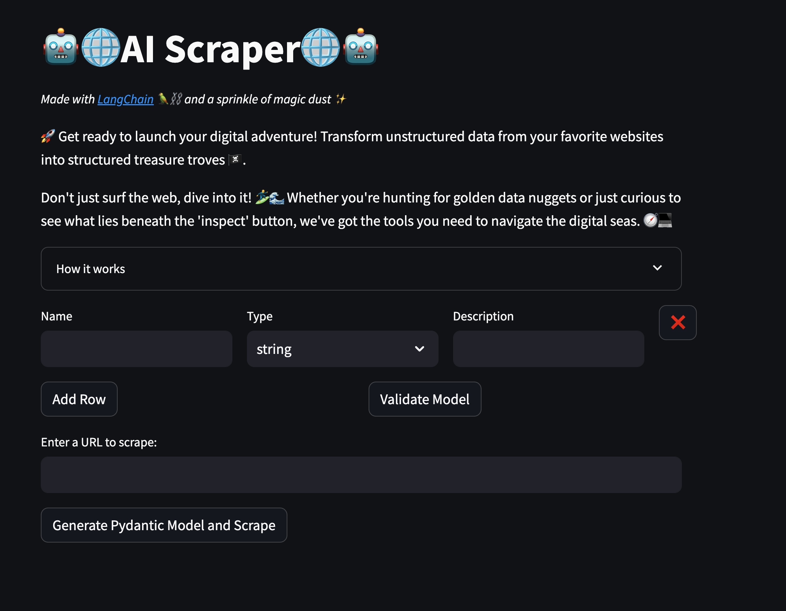

# Enhancing Web Scraping with Large Language Models: A Modern Approach

When I was starting out as a Data Engineer (back in 2016), one of my first tasks was to scrape data from a variety of websites. 
**Web scraping** involves the use of automated tools to extract large amounts of data from websites, 
typically from their **HTML**.

I remember building around the application, digging into the HTML code, and trying to figure out the best solutions 
for scraping all the data. One of my main challenges was dealing with frequent changes to the websites; 
for example, the Amazon pages I was scraping changed every one to two weeks.

One thought that occurred to me when I started reading about Large Language Models (LLMs) was, 
*"Can I avoid all those pitfalls I faced using LLMs to structure data from webpages?"*

Let's see if I can.

## Web scraping tools and techniques

Back in the day, the two main tools that I used were **request**, **BeautifulSoup** and **Selenium**. Each serves 
distinct purposes and caters to different types of web environments.

- **Request**  is a Python library that provides a straightforward API for performing HTTP operations like 
GET and POST. This library executes HTTP requests against web servers specified by URLs. It is often used 
to obtain the HTML content that BeautifulSoup can parse.
- **BeautifulSoup** is a Python package for parsing HTML and XML documents, including those with malformed markup. 
It creates a parse tree for documents that can be used to extract data from HTML, 
which is useful for web scraping. Normally it is used with others tools that will provide the HTML code such as
requests or Selenium.
- **Selenium** is used primarily for dynamic websites that rely heavily on JavaScript. Unlike **BeautifulSoup**, 
**Selenium** does not just parse the HTML; it interacts with web pages by simulating user actions 
like clicking and scrolling. This allows it to retrieve data from websites that load content dynamically.

These tools were indispensable when I was trying to extract data from websites. However, they also posed some 
challenges: code, tags, and structural elements had to be regularly updated to accommodate changes in the 
website's layout, complicating long-term maintenance.

## What are Large Language Models (LLMs)?

**Large Language Models** (LLMs) are advanced AI systems trained on vast amounts of text data. They possess a remarkable 
ability to understand and generate human-like text, making them highly effective at processing and interpreting 
language in a way that mimics human comprehension. This capability is particularly useful in scenarios where the 
context and nuances of text data are crucial.

## Integrating LLMs into Web Scraping

The process of web scraping can be enhanced significantly by incorporating LLMs. The idea is to parse the HTML 
code from the webpage and use the LLM to extract the objects from it. This approach can reduce maintenance 
efforts when HTML structures change, as the content itself typically remains the same.



Here’s how the architecture of such an integrated system would look:

1. **Getting HTML**: Use tools like Selenium or Requests to fetch the HTML content of a webpage.
Selenium can handle dynamic content loaded with JavaScript, while Requests is suited for static pages.

2. **Parsing HTML**: Once the HTML is retrieved, BeautifulSoup is employed to parse this HTML as a text
and delete the noise in the HTML (footer, header, etc.).

3. **Creating Pydantic Models**: Define the pydantic model's object that we wanted to scrape.
This ensures that the data is structured and typed according to predefined schemas.

4. **Generating Prompts for LLMs**: Develop a prompt that instructs the LLM on what information needs to 
be extracted. This step is crucial for guiding the LLM’s extraction process.

5. **Processing by LLM**: Feed the HTML content and the prompt into the LLM. The model interprets 
the content and applies the instructions from the prompt to extract and structure the data.

6. **Output of Structured Data**: The LLM outputs the data as structured objects defined by the Pydantic models. 
This structured data is more manageable and can be directly utilized in various applications.

By following this workflow, LLMs can transform raw HTML into structured, meaningful data, alleviating many of 
the traditional challenges associated with web scraping, such as dealing with non-standard formats and 
dynamically generated content.

## Integration of LangChain with BeautifulSoup and Pydantic

I have chosen for the first part of the web scraping project this static webpage: https://www.civitatis.com/es/budapest/. The idea is to scrape all the activities listed there and present them in a more manageable way.

This initial step will extract the raw HTML from the static webpage. The goal is to clean up the HTML slightly before it is processed by the LLM.

```python

from bs4 import BeautifulSoup
import requests


def extract_html_from_url(url):
    try:
        # Fetch HTML content from the URL using requests
        response = requests.get(url)
        response.raise_for_status()  # Raise an exception for bad responses (4xx and 5xx)

        # Parse HTML content using BeautifulSoup
        soup = BeautifulSoup(response.content, "html.parser")
        excluded_tagNames = ["footer", "nav"]
        # Exclude elements with tag names 'footer' and 'nav'
        for tag_name in excluded_tagNames:
            for unwanted_tag in soup.find_all(tag_name):
                unwanted_tag.extract()

        # Process the soup to maintain hrefs in anchor tags
        for a_tag in soup.find_all("a"):
            href = a_tag.get("href")
            if href:
                a_tag.string = f"{a_tag.get_text()} ({href})"

        return ' '.join(soup.stripped_strings)  # Return text content with preserved hrefs

    except requests.exceptions.RequestException as e:
        print(f"Error fetching data from {url}: {e}")
        return None

```

The next step is to define the Pydantic objects, as we are going to scrape activities. Two objects need to be created:

- **Activity**: This object will represent the activity itself, with all the attributes and data types specified. Note that some fields are marked as *Optional* because they are not available for all activities. It is also beneficial to provide a description and an example of the fields that you intend to extract.
- **ActivityScraper**: This will be a wrapper around the **Activity** object. It will assist in retrieving information and organizing the data into a list format.

```python
from pydantic import BaseModel, Field
from typing import Optional

class Activity(BaseModel):
    title: str = Field(description="The title of the activity.")
    rating: float = Field(description="The average user rating out of 10.")
    reviews_count: int = Field(description="The total number of reviews received.")
    travelers_count: Optional[int] = Field(description="The number of travelers who have participated.")
    cancellation_policy: Optional[str] = Field(description="The cancellation policy for the activity.")
    description: str = Field(description="A detailed description of what the activity entails.")
    duration: str = Field(description="The duration of the activity, usually given in hours or days.")
    language: Optional[str] = Field(description="The primary language in which the activity is conducted.")
    category: str = Field(description="The category of the activity, such as 'Boat Trip', 'City Tours', etc.")
    price: float = Field(description="The price of the activity.")
    currency: str = Field(description="The currency in which the price is denominated, such as USD, EUR, GBP, etc.")

    
class ActivityScrapper(BaseModel):
    Activities: list[Activity] = Field("List of all the activities listed in the text")
```

Finally, we have the configuration of the LLM. We will use the LangChain library, which provides an excellent toolkit to get started.

A key component here is the **PydanticOutputParser**. Essentially, this will translate our object into instructions, as illustrated in the **Prompt**, and also parse the output of the LLM to retrieve the corresponding list of objects.

```python
from langchain.prompts import PromptTemplate
from langchain.output_parsers import PydanticOutputParser
from langchain_openai import ChatOpenAI
from dotenv import load_dotenv

load_dotenv()

llm = ChatOpenAI(temperature=0)
output_parser = PydanticOutputParser(pydantic_object = ActivityScrapper)

prompt_template = """
You are an expert making web scrapping and analyzing HTML raw code.
If there is no explicit information don't make any assumption.
Extract all objects that matched the instructions from the following html
{html_text}
Provide them in a list, also if there is a next page link remember to add it to the object.
Please, follow carefulling the following instructions
{format_instructions}
"""

prompt = PromptTemplate(
    template=prompt_template,
    input_variables=["html_text"],
    partial_variables={"format_instructions": output_parser.get_format_instructions}
)

chain = prompt | llm | output_parser
```

The final step is to invoke the chain and retrieve the results.

```python
url = "https://www.civitatis.com/es/budapest/"
html_text_parsed = extract_html_from_url(url)
activites = chain.invoke(input={
    "html_text": html_text_parsed
})
activites.Activities
```

Here is what the data looks like, it takes 46 seconds to scrape the entire webpage.

```notebook
[Activity(title='Paseo en barco al anochecer', rating=8.4, reviews_count=9439, travelers_count=118389, cancellation_policy='Cancelación gratuita', description='En este crucero disfrutaréis de las mejores vistas de Budapest cuando se viste de gala, al anochecer. El barco es panorámico y tiene partes descubiertas.', duration='1 hora', language='Español', category='Paseos en barco', price=21.0, currency='€'),
 Activity(title='Visita guiada por el Parlamento de Budapest', rating=8.8, reviews_count=2647, travelers_count=34872, cancellation_policy='Cancelación gratuita', description='El Parlamento de Budapest es uno de los edificios más bonitos de la capital húngara. Comprobadlo vosotros mismos en este tour en español que incluye la entrada.', duration='2 horas', language='Español', category='Visitas guiadas y free tours', price=27.0, currency='€')
 ...
]
```

## Demo and full repository

I have created a quick demo using Streamlit available [here](https://github.com/NachoCP/AIScraping).

In the first part, you are introduced to the model. You can add as many rows as you need and specify the name, type, and description of each attribute. This will automatically generate a Pydantic model to be used in the web scraping component.

The second part allows you to enter the desired URL, and the scraped data will be displayed at the bottom of the page. There is also a download button for exporting the data in JSON format.

Feel free to explore and experiment with it!



## Conclusion

As we harness the ever-evolving capabilities of Large Language Models (LLMs), we uncover new possibilities for efficiently extracting valuable information from websites. 

By automating the tedious process of web scraping, LLMs not only save time but also ensure a high degree of accuracy in data retrieval. This automation reduces human error and increases the consistency of the data collected, which is particularly valuable in scenarios where large volumes of information are processed. 

Our experience using custom LLM configurations to scrape and reformat data into JSON has demonstrated the practical applications of this technology in real-world scenarios.

However, we must consider that sending raw HTML to the LLM incurs a token cost. Since HTML often includes various tags, attributes, and content, the token count can quickly add up, leading to higher usage of computational resources.  LLMs charge based on the number of tokens processed, meaning extensive or complex HTML structures can significantly increase the expense. 

Therefore, it's important to preprocess and clean the HTML, removing unnecessary tags and metadata, to reduce the token count before submission. This approach helps manage costs effectively while still leveraging the powerful capabilities of LLMs for web scraping and data extraction.

The right tool for the right job!
